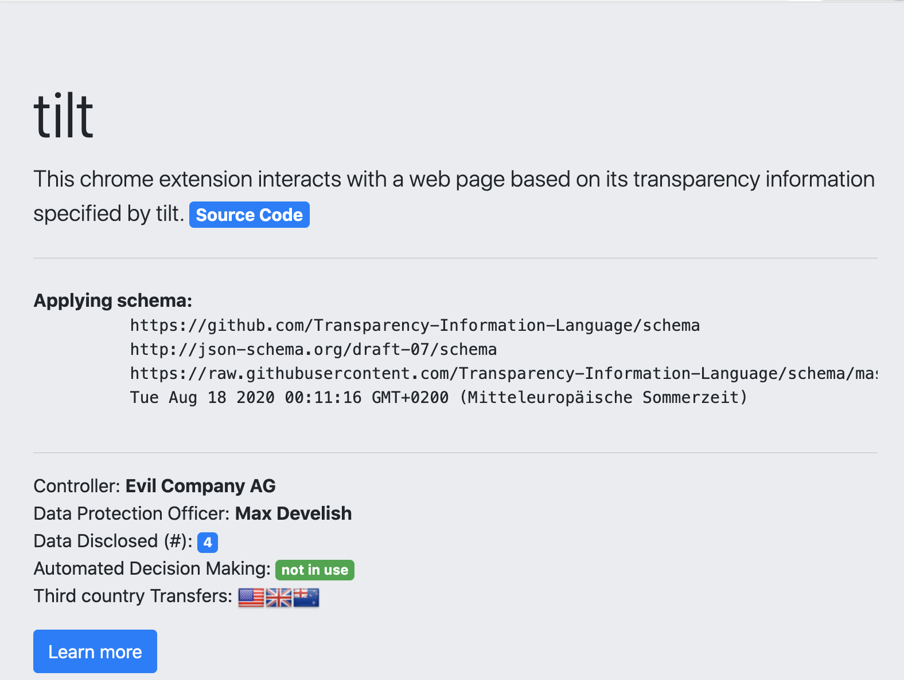

# chrome-tilt
This chrome extension interacts with a web page based on its transparency information specified by [tilt](https://github.com/Transparency-Information-Language).

## Installation

1. Download the contents of this repository.
2. Go to [chrome://extensions/]() and check the box for Developer mode in the top right corner.
3. Load your own extension and select the downloaded folder.
4. Check your extensions menu.
5. Click on the extension's icon.

|   |  |
|---|---|

## Attributions
Icon made by [Wichai.wi](https://www.flaticon.com/free-icon/gdpr_1355236) from [Flaticon](https://www.flaticon.com/).

## Author
Elias Grünewald

## License
GNU General Public License, Version 3

